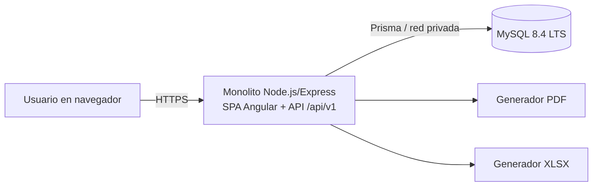

# Diseño técnico

## 1. Contexto y decisiones

Este diseño implementa `requirements.md` como monolito modular. La SPA y la API se desarrollan separadas para ergonomía, pero forman una sola imagen y un único origen HTTP en producción. MySQL es una dependencia de infraestructura, no otro servicio de negocio.

Decisiones principales:

- Venta normalizada en cabecera, líneas y pagos, en lugar de 14 grupos de columnas.
- Snapshot de nombre/precio sugerido por línea para preservar el histórico.
- Pagos separados de líneas para soportar pago único o dividido sin acoplar medio de pago a cada servicio.
- Fechas de negocio explícitas y timestamps UTC.
- Baja lógica para entidades históricas.
- RBAC más restricciones de propiedad/fecha en casos de uso.

## 2. Vista de contenedores



No hay acceso directo del navegador a MySQL ni a generadores externos.

## 3. Módulos y responsabilidades

| Módulo | Responsabilidad | Requisitos |
|---|---|---|
| Auth | login, refresh, logout, sesiones, password inicial | AUTH-001 |
| Users | cuentas, roles, estado, último admin | USER-001 |
| Catalogs | servicios, categorías, medios de pago, precios, orden y estado | SVC-001, CAT-001 |
| Sales | venta, líneas, pagos, permisos y anulaciones | SALE-001…004 |
| Reports | periodos, KPIs, agregaciones y exportación | REPORT-001, EXPORT-001 |
| Audit | eventos append-only y consulta admin | AUDIT-001 |
| Preferences/i18n | idioma de usuario, carga de traducciones y formato | I18N-001 |
| Brand assets | logotipos, tokens visuales y variantes optimizadas | BRAND-001 |

## 4. Modelo de datos

Todos los ids públicos son UUID. Los importes usan `DECIMAL(12,2)` para EUR. Los timestamps son UTC; `business_date` es `DATE`.

### `users`

- `id` PK
- `name` VARCHAR(120)
- `email` VARCHAR(254), original para mostrar
- `normalized_email` VARCHAR(254), UNIQUE
- `password_hash` VARCHAR(255)
- `role` ENUM(`ADMIN`,`SENIOR_ASSISTANT`,`ASSISTANT`)
- `status` ENUM(`ACTIVE`,`INACTIVE`)
- `must_change_password` BOOLEAN
- `preferred_locale` ENUM(`es`,`en`) DEFAULT `es`
- `token_version` INT
- `created_at`, `updated_at`, `deactivated_at`

### `auth_sessions`

- `id` PK, `user_id` FK
- `refresh_token_hash`, `expires_at`, `revoked_at`, `rotated_from_id`
- `created_at`, `last_used_at`, `ip_hash`, `user_agent_summary`

### `services`

- `id` PK
- `category_id` FK nullable a service_categories
- `name`, `normalized_name` UNIQUE
- `description` nullable
- `suggested_price` DECIMAL(12,2)
- `currency` CHAR(3)
- `status` ENUM(`ACTIVE`,`INACTIVE`)
- `created_by`, `updated_by` FK users
- `created_at`, `updated_at`, `deactivated_at`

### `service_categories`

- `id` PK
- `name`, `normalized_name` UNIQUE
- `description` nullable
- `display_order` INT
- `status` ENUM(`ACTIVE`,`INACTIVE`)
- `created_by`, `updated_by` FK users
- `created_at`, `updated_at`, `deactivated_at`

### `payment_methods`

- `id` PK
- `code`, `normalized_code` UNIQUE, estable para integración interna
- `name`, `normalized_name` UNIQUE, visible al usuario
- `description` nullable
- `display_order` INT
- `status` ENUM(`ACTIVE`,`INACTIVE`)
- `created_by`, `updated_by` FK users
- `created_at`, `updated_at`, `deactivated_at`

### `sales`

- `id` PK, `folio` VARCHAR(32) UNIQUE
- `business_date` DATE
- `currency` CHAR(3)
- `status` ENUM(`POSTED`,`VOIDED`)
- `total_amount` DECIMAL(12,2)
- `notes` VARCHAR(1000) nullable
- `created_by`, `updated_by`, `voided_by` FK users
- `void_reason` nullable
- `version` INT
- `created_at`, `updated_at`, `voided_at`

### `sale_items`

- `id` PK, `sale_id` FK, `service_id` FK
- `service_name_snapshot` VARCHAR(160)
- `quantity` SMALLINT UNSIGNED
- `suggested_unit_price_snapshot` DECIMAL(12,2)
- `effective_unit_price` DECIMAL(12,2)
- `price_override_reason` VARCHAR(300) nullable
- `line_total` DECIMAL(12,2)
- `position` SMALLINT

### `sale_payments`

- `id` PK, `sale_id` FK
- `payment_method_id` FK
- `payment_method_code_snapshot` VARCHAR(50)
- `payment_method_name_snapshot` VARCHAR(120)
- `amount` DECIMAL(12,2)
- `reference` VARCHAR(120) nullable
- `position` SMALLINT

### `idempotency_keys`

- `id`, `scope`, `key_hash`, `request_hash`, `response_status`, `response_body`, `expires_at`
- UNIQUE (`scope`, `key_hash`)

### `audit_events`

- `id` PK
- `actor_user_id` nullable para fallos de login
- `action`, `entity_type`, `entity_id`
- `before_json`, `after_json` JSON redactado
- `request_id`, `occurred_at`, `metadata_json`

Índices mínimos:

- `sales(business_date, status)`, `sales(created_by, business_date)`, `sales(folio)`.
- `service_categories(status, display_order)`, `payment_methods(status, display_order)`.
- `sale_items(service_id, sale_id)` y `sale_payments(payment_method_id, sale_id)`.
- `audit_events(occurred_at)`, `(actor_user_id, occurred_at)`, `(entity_type, entity_id)`.
- Índices/constraints de FKs y uniques descritos arriba.

## 5. Invariantes y transacciones

Para crear o editar una venta, una transacción debe:

1. autenticar y autorizar actor/fecha;
2. cargar servicios y medios de pago activos, incluidos sus precios y nombres actuales;
3. validar cantidades, precios y la nota obligatoria de cualquier cambio respecto al precio precargado;
4. calcular cada línea con aritmética decimal;
5. validar que `sum(payments) == sum(items)`;
6. persistir cabecera, líneas y pagos;
7. escribir auditoría;
8. almacenar respuesta idempotente cuando aplique;
9. confirmar o revertir todo.

El cliente no envía `suggestedPriceSnapshot`, `lineTotal` ni `totalAmount` como autoridad. Si se incluyen para vista previa, el servidor los ignora y devuelve los calculados.

## 6. Contrato API inicial

Prefijo `/api/v1`. JSON usa camelCase. Listas responden `{ data, page: { cursor, nextCursor, hasNext } }`.

### Auth

- `POST /auth/login`
- `POST /auth/refresh`
- `POST /auth/logout`
- `GET /auth/me`
- `POST /auth/change-password`

### Users

- `GET /users?query=&role=&status=&cursor=` — admin
- `POST /users` — admin
- `GET /users/:id` — admin
- `PATCH /users/:id` — admin
- `POST /users/:id/deactivate` — admin
- `POST /users/:id/activate` — admin
- `PATCH /users/me/preferences` — usuario autenticado; body `{ "locale": "es" | "en" }`

### Services

- `GET /services?query=&status=&cursor=` — admin; para ventas, perfiles activos reciben solo activos
- `POST /services` — admin
- `GET /services/:id`
- `PATCH /services/:id` — admin
- `POST /services/:id/deactivate` — admin
- `POST /services/:id/activate` — admin

### Service categories

- `GET /service-categories?query=&status=&cursor=` — admin; los demás perfiles reciben solo activas en selectores autorizados
- `POST /service-categories` — admin
- `PATCH /service-categories/:id` — admin
- `POST /service-categories/:id/deactivate` — admin
- `POST /service-categories/:id/activate` — admin

### Payment methods

- `GET /payment-methods?query=&status=&cursor=` — admin; los demás perfiles reciben solo activos en el formulario de venta
- `POST /payment-methods` — admin
- `PATCH /payment-methods/:id` — admin
- `POST /payment-methods/:id/deactivate` — admin
- `POST /payment-methods/:id/activate` — admin

### Sales

- `GET /sales?from=&to=&authorId=&serviceId=&paymentMethodId=&status=&cursor=` — scope según rol
- `POST /sales` — todos los roles, con `Idempotency-Key`
- `GET /sales/:id` — scope según rol
- `PUT /sales/:id` — admin, reemplazo completo y `If-Match`
- `POST /sales/:id/void` — admin

Ejemplo de creación:

```json
{
  "businessDate": "2026-07-14",
  "items": [
    {
      "serviceId": "uuid",
      "quantity": 1,
      "effectiveUnitPrice": "30.00",
      "priceOverrideReason": "Promoción de bienvenida"
    }
  ],
  "payments": [
    { "paymentMethodId": "uuid-tarjeta", "amount": "20.00" },
    { "paymentMethodId": "uuid-efectivo", "amount": "10.00" }
  ],
  "notes": "Opcional"
}
```

### Reports

- `GET /reports/sales?period=day|week|month|year&anchor=YYYY-MM-DD`
- `GET /reports/sales?from=YYYY-MM-DD&to=YYYY-MM-DD`
- `GET /reports/sales/export?format=pdf|xlsx&...mismosFiltros`

### Audit

- `GET /audit-events?from=&to=&actorId=&action=&entityType=&cursor=` — admin

### Errores

Usar `application/problem+json`:

```json
{
  "type": "https://app.example/problems/payment-total-mismatch",
  "title": "Los pagos no coinciden con el total",
  "status": 422,
  "detail": "Faltan 5,00 EUR por asignar.",
  "instance": "/api/v1/sales",
  "requestId": "...",
  "errors": [{ "path": "payments", "code": "PAYMENT_TOTAL_MISMATCH" }]
}
```

Códigos: `400` sintaxis, `401` no autenticado, `403` acción global prohibida, `404` recurso inexistente/no visible, `409` conflicto, `422` regla de negocio, `429` límite, `500` error opaco.

## 7. Autorización

La cadena es:

`authenticate → load current user → require capability → enforce record scope → execute use case`.

- Los guards de ruta cubren capacidades gruesas.
- El caso de uso comprueba propiedad, fecha actual, estado y rol nuevamente.
- Las consultas incorporan scope; no se carga una venta ajena para luego ocultarla.
- Los reportes requieren `reports:read` y nunca aceptan `authorId` como medio para ampliar privilegios.
- La política de reportes permite al administrador día/semana/mes/año/rango y al senior exclusivamente día/mes, tanto para consulta como exportación.

## 8. Cálculo de reportes

El periodo se resuelve en backend:

- día: fecha indicada;
- semana: lunes a domingo ISO que contiene `anchor`;
- mes: primer a último día del mes;
- año: 1 de enero a 31 de diciembre;
- personalizado: extremos inclusivos, máximo cinco años.

Después de resolver el periodo, la autorización verifica su tipo: `SENIOR_ASSISTANT` solo admite `day` o `month`; intentar `week`, `year` o `custom` responde `403` antes de consultar datos.

KPIs:

- `grossRevenue = SUM(sales.total_amount WHERE POSTED)`
- `salesCount = COUNT(sales WHERE POSTED)`
- `serviceUnits = SUM(sale_items.quantity WHERE sale POSTED)`
- `averageTicket = grossRevenue / salesCount`, cero si no hay ventas
- `voidedAmount` y `voidedCount` separados

Desgloses por fecha/servicio/autor usan líneas; por medio de pago usa pagos. La aplicación compara sumas y registra una alerta si se rompe una invariante histórica.

## 9. Exportaciones

Los exportadores reciben un `ReportSnapshot` ya autorizado y calculado. No vuelven a interpretar permisos ni recalculan con reglas diferentes.

El exportador recibe además el `preferredLocale` del actor autenticado; no confía en un locale arbitrario para ampliar comportamiento. Títulos, encabezados, nombres de hojas, periodos, fechas y formatos se resuelven con el mismo catálogo semántico usado por la aplicación. Los nombres de catálogo creados por el negocio permanecen sin traducción.

- PDF: A4, cabecera, filtros, KPIs, tablas paginadas, pie y aviso de moneda.
- La cabecera PDF usa el sello `logos/IMG-20260714-WA0010.jpg` junto al texto `Lina Quirama Beauty Salon`; la dirección es opcional y su ausencia no deja espacios vacíos.
- XLSX: identifica a `Lina Quirama Beauty Salon` en resumen/propiedades, usa valores de dinero numéricos con formato de moneda, fechas como fechas, texto neutralizado, filtros y panel congelado. Conserva exactamente cuatro hojas localizadas: resumen analítico con KPIs y desgloses, ventas a nivel de cabecera, servicios a nivel de línea y pagos a nivel de asignación. Las tres hojas de detalle comparten folio, fecha y usuario para permitir cruces; servicios incluye precio sugerido/efectivo, diferencia, subtotal, motivo y medios de la venta, mientras pagos incluye código, medio, referencia, importe, total y servicios asociados.
- Para el volumen del MVP, respuesta síncrona con streaming y timeout controlado. Si supera el límite futuro, requerirá otra spec para jobs asíncronos.

## 10. Frontend

### Rutas

- `/login`
- `/dashboard`
- `/sales/new`
- `/sales`
- `/sales/:id`
- `/catalogs/services`
- `/catalogs/service-categories`
- `/catalogs/payment-methods`
- `/users`
- `/reports`
- `/audit`

Cada ruta declara capacidades y se lazy-load. Los guards orientan navegación; el interceptor trata `401`, refresh único concurrente y errores problem+json.

Los formularios emergentes y confirmaciones se implementan mediante componentes/plantillas Angular accesibles. No se invocan los diálogos nativos bloqueantes del navegador (`alert`, `confirm`, `prompt`). El diálogo atrapa el foco, cierra mediante una acción explícita o `Escape` cuando no hay una operación en curso y restaura el foco al control que lo abrió.

Los formularios Angular mantienen estado de intento de envío y errores por campo. Cada control inválido expone `aria-invalid`, enlaza su mensaje mediante `aria-describedby` y conserva una ayuda breve junto al campo. Un resumen con `role="alert"` aparece al inicio del contexto activo y recibe foco cuando corresponde. Los errores de API se muestran en el mismo formulario o diálogo que originó la solicitud. Las confirmaciones de operaciones principales usan un diálogo accesible; para ventas incluye folio, total y siguientes acciones, sin temporizadores que oculten información antes de que el usuario la lea.

### Internacionalización

- `LocaleService` mantiene una Signal con `es | en`, inicializada desde la sesión del usuario y con fallback `es`.
- Antes de autenticar, el login puede conservar el locale en almacenamiento local; después de autenticar, `GET /auth/me` devuelve `preferredLocale` y la cuenta pasa a ser la fuente de verdad.
- Cada feature carga diccionarios equivalentes `i18n/es.json` e `i18n/en.json` bajo claves semánticas estables.
- El selector guarda mediante `/users/me/preferences` y aplica el locale de forma optimista, revirtiendo con mensaje localizado si falla.
- `Intl.DateTimeFormat`, `Intl.NumberFormat` y adaptadores Angular formatean fechas, números y EUR; la zona de negocio continúa siendo `Europe/Brussels`.
- Los códigos de error de API son estables; el frontend resuelve el mensaje localizado. Para PDF/XLSX, el backend utiliza catálogos de traducción compartidos o equivalentes verificados.
- Una prueba de CI compara recursivamente las claves `es` y `en` y detecta textos críticos incrustados.

### Activos de marca y tema

- `logos/` conserva los JPG originales como fuente de verdad y no participa directamente en imports de componentes.
- Un script genera `apps/web/src/assets/brand/logo-vertical.{webp,avif}` y `logo-seal.{webp,avif}`, además de fallback JPG, sin recorte ni cambio de color.
- Un componente presentacional `BrandLogoComponent` centraliza variante `vertical | seal`, tamaños responsive, `object-fit: contain`, alt y fallback textual.
- Los tokens de tema se derivan visualmente de los logotipos y se fijan en `packages/ui-tokens`: texto carbón sobre superficies claras, marfil sobre oscuras y cobre/melocotón como acentos condicionados por contraste.
- Un test automatizado evalúa las parejas foreground/background de estados normal, hover, focus, active, selected, disabled y error. Ningún token se aprueba por armonía visual solamente.
- El exportador PDF usa una copia embebible del sello oficial para que el documento sea reproducible sin llamadas de red.

### Estado del formulario de venta

Formulario reactivo tipado:

- `businessDate`
- `items: FormArray<SaleItemForm>`
- `payments: FormArray<PaymentForm>`
- `notes`

Un servicio de cálculo decimal muestra preview y restante, pero el resultado definitivo es el del servidor. Cuando el precio efectivo deja de coincidir con el precargado, el formulario revela `priceOverrideReason`, lo marca obligatorio, impide el envío sin nota y conserva ambos precios para que el backend los audite. Autosave local de borrador PUEDE implementarse sin almacenar tokens ni datos sensibles y debe borrarse al éxito/logout.

## 11. Despliegue y operación

### Inicio de contenedor `app`

1. valida variables;
2. espera health de MySQL;
3. aplica migraciones bajo bloqueo para evitar carreras;
4. crea primer admin solo si no existe ninguno y las variables bootstrap están presentes;
5. inicia Express como usuario no root;
6. reporta readiness.

### CI

En pull request: install reproducible, format, lint, typecheck, unit, integration con MySQL, build Angular/API, validación OpenAPI, E2E smoke y escaneos. En main: además construir imagen versionada y smoke test con Compose.

## 12. Riesgos y mitigaciones

| Riesgo | Mitigación |
|---|---|
| Diferencias monetarias | DECIMAL, biblioteca decimal, cálculo servidor y pruebas de propiedad |
| Acceso de asistentes a ventas ajenas | scope en consulta, 404 opaco y pruebas IDOR por rol |
| Cambio de precio borra historia | snapshots en líneas y auditoría |
| Renombrar/desactivar un medio altera historia | snapshots de código/nombre del medio en cada pago |
| Fecha incorrecta cerca de medianoche | `businessDate`, zona IANA y pruebas DST |
| Exportación inconsistente | un `ReportSnapshot` común para UI/PDF/XLSX |
| Pérdida de datos Docker | volumen nombrado, backup/restore y apagado no destructivo |
| Scripts divergentes entre SO | npm como orquestador y wrappers mínimos Bash/PowerShell |
